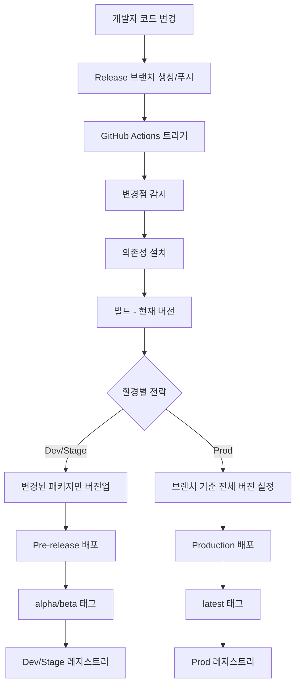

# 📦 패키지 배포 가이드

## 🔄 배포 워크플로우 흐름

### 전체 흐름도



### 상세 단계별 흐름

#### 1️⃣ **준비 단계**
```
🔧 Setup
├── Checkout 코드
├── Node.js 설정
├── pnpm 설치
└── 의존성 설치
```

#### 2️⃣ **변경점 감지**
```
🔍 Change Detection
├── 마지막 릴리스 태그와 비교
├── 변경된 파일 분석 (src/, package.json)
└── 영향받은 패키지 목록 생성
```

#### 3️⃣ **빌드 (현재 버전)**
```
🏗️ Build
├── 현재 버전으로 안전하게 빌드
├── 모든 의존성 존재 보장
└── dist/ 결과물 생성
```

#### 4️⃣ **버전 관리 (빌드 후)**
```
📝 Version Management
├── Dev/Stage: 변경된 패키지만 patch 증분
│   ├── changeset 자동 생성
│   ├── pre-release 모드 진입
│   └── 개별 버전 증분 (1.16.6 → 1.16.7-alpha.1)
│
└── Prod: 브랜치 기준 전체 버전
    └── release/X.Y.Z → X.Y.Z 설정
```

#### 5️⃣ **배포**
```
🚀 Deploy
├── Dev: alpha 태그로 dev 레지스트리
├── Stage: beta 태그로 stage 레지스트리
└── Prod: latest 태그로 prod 레지스트리
```

---

## 🎯 개발자 가이드

### 배포 방법

#### **방법 1: Release 브랜치 배포 (권장)**

1. **Release 브랜치 생성**
   ```bash
   git checkout -b release/1.16.7
   # 코드 수정
   git commit -m "feat: add new feature"
   git push origin release/1.16.7
   ```

2. **GitHub Actions 실행**
   - Repository → Actions → "CI - Publish & Build"
   - **Manual trigger** 클릭

3. **환경 선택 (Release 브랜치)**
   ```json
   {
     "environment": "dev",           // dev, stage, prod
     "services": "package-publish",  // 패키지 배포
     "manual_version": "",           // 선택사항: 비우면 브랜치명에서 추출 (1.16.7)
     "dependency_overrides": "",     // 선택사항: 특정 의존성 버전 지정
     "dry_run": "false"             // 실제 배포 여부
   }
   ```

#### **방법 2: Develop 브랜치 배포**

1. **Develop 브랜치에서 작업**
   ```bash
   git checkout develop
   # 코드 수정
   git commit -m "feat: experimental feature"
   git push origin develop
   ```

2. **GitHub Actions 실행**
   - Repository → Actions → "CI - Publish & Build"
   - **Manual trigger** 클릭

3. **환경 선택 (Develop 브랜치 - manual_version 필수)**
   ```json
   {
     "environment": "dev",                    // dev만 가능 (실험적 기능)
     "services": "package-publish",           
     "manual_version": "1.16.7-experiment.1", // 필수: 배포할 버전 직접 입력
     "dependency_overrides": "",              
     "dry_run": "false"                      
   }
   ```

#### **방법 3: 수동 버전 지정 (Release 브랜치)**

Release 브랜치에서 브랜치명과 다른 버전으로 배포하고 싶은 경우:
```json
{
  "environment": "dev",
  "services": "package-publish", 
  "manual_version": "1.16.8-hotfix.1",  // 브랜치명(1.16.7)과 다른 버전
  "dry_run": "false"
}
```

#### **방법 4: 의존성 오버라이드**

특정 의존성 버전을 지정하고 싶은 경우:
```json
{
  "environment": "dev",
  "services": "package-publish",
  "dependency_overrides": "{\"@to-nexus/core\":\"1.16.5\",\"viem\":\"2.37.0\"}"
}
```

---

## 🌿 브랜치별 배포 전략

### **Release 브랜치** (`release/X.Y.Z`)
- **버전 결정**: 브랜치명에서 자동 추출 (예: `release/1.16.7` → `1.16.7`)
- **manual_version**: 선택사항 (오버라이드 가능)
- **용도**: 정식 릴리스 준비
- **환경**: dev → stage → prod 순차 배포

### **Develop 브랜치** (`develop`)
- **버전 결정**: `manual_version` **필수 입력**
- **manual_version**: 필수 (예: `1.16.7-experiment.1`)
- **용도**: 실험적 기능, 핫픽스 테스트
- **환경**: dev만 가능

### **기타 브랜치** (`feature/*`, `fix/*` 등)
- **버전 결정**: `manual_version` **필수 입력**
- **manual_version**: 필수 (예: `1.16.7-feature-auth.1`)
- **용도**: 기능 브랜치 테스트
- **환경**: dev만 권장

---

## 🌍 환경별 배포 전략

### **Dev 환경** 🧪
- **목적**: 개발/테스트
- **버전 전략**: 변경된 패키지만 patch 증분
- **태그**: `alpha` (예: `1.16.7-alpha.1`)
- **레지스트리**: `dev-cross-sdk-js`
- **브랜치**: `release/*`

### **Stage 환경** 🎭
- **목적**: 스테이징/QA
- **버전 전략**: 변경된 패키지만 patch 증분  
- **태그**: `beta` (예: `1.16.7-beta.1`)
- **레지스트리**: `stage-cross-sdk-js`
- **브랜치**: `release/*`

### **Prod 환경** 🚀
- **목적**: 프로덕션 배포
- **버전 전략**: 브랜치 기준 전체 버전
- **태그**: `latest` (예: `1.16.7`)
- **레지스트리**: `cross-sdk-js`
- **브랜치**: `main` 또는 `release/*`

#### **운영 배포 시 태그/버전 흐름 (`release/1.16.7` 예시):**

```
🌿 브랜치: release/1.16.7
    ↓
📝 버전 추출: 1.16.7 (브랜치명에서)
    ↓  
🏗️ 빌드: 현재 버전(1.16.6)으로 빌드
    ↓
📝 버전 설정: 모든 패키지를 1.16.7로 설정
    ↓
🚀 배포: @to-nexus/appkit@1.16.7 (latest 태그)
    ↓
🏷️ Git 태그: release/1.16.7 생성
    ↓
📋 GitHub Release: v1.16.7 생성
```

**결과:**
- **NPM 패키지**: `@to-nexus/appkit@1.16.7` (latest)
- **Git 태그**: `release/1.16.7`  
- **GitHub Release**: `v1.16.7`
- **레지스트리**: `https://package.cross-nexus.com/repository/cross-sdk-js`

---

## 📋 배포 체크리스트

### **배포 전 확인사항**
- [ ] 코드 리뷰 완료
- [ ] 테스트 통과
- [ ] 브랜치명이 `release/X.Y.Z` 형식
- [ ] 변경사항이 올바른 패키지에 포함됨

### **배포 후 확인사항**
- [ ] Nexus 레지스트리에 패키지 업로드 확인
- [ ] 올바른 dist-tag 설정 확인 (alpha/beta/latest)
- [ ] 의존성 해결 테스트
- [ ] 샘플 애플리케이션 동작 확인

---

## 🔧 트러블슈팅

### **자주 발생하는 문제**

#### **1. 순환 참조 에러**
```
Invalid package dependency graph: cyclic dependency detected
```
**해결**: `align-workspace-deps.cjs`에서 예외 처리된 패키지 확인

#### **2. 버전 불일치**
```
Package "X" must depend on the current version of "Y"
```
**해결**: examples의 workspace 의존성 확인 (`workspace:*`)

#### **3. 의존성 설치 실패**
```
ERR_PNPM_NO_MATCHING_VERSION
```
**해결**: 레지스트리 인증 및 패키지 존재 여부 확인

#### **4. 빌드 실패**
```
Cannot find module '@to-nexus/core'
```
**해결**: 의존성 버전 확인 및 레지스트리 설정 점검

---

## 🎛️ 고급 사용법

### **선택적 패키지 배포**

특정 패키지만 배포하고 싶은 경우:
```bash
# 1. 해당 패키지만 수정
# 2. changeset 생성
pnpm changeset add
# 3. 워크플로우 실행 시 자동으로 해당 패키지만 버전업
```

### **핫픽스 배포**

긴급 수정이 필요한 경우:
```json
{
  "environment": "prod",
  "services": "package-publish",
  "manual_version": "1.16.7-hotfix.1",
  "dependency_overrides": "{\"@to-nexus/core\":\"1.16.6\"}"
}
```

### **레지스트리 시딩**

새로운 환경에 기존 패키지를 복사하는 경우:
```bash
# Bash 스크립트 사용
./scripts/seed-registry.sh dev
./scripts/seed-registry.sh stage
```

---

## 📊 배포 현황 확인

### **레지스트리별 패키지 확인**
- **Dev**: https://package.cross-nexus.com/repository/dev-cross-sdk-js
- **Stage**: https://package.cross-nexus.com/repository/stage-cross-sdk-js  
- **Prod**: https://package.cross-nexus.com/repository/cross-sdk-js

### **태그별 버전 확인**
```bash
# 특정 패키지의 태그별 버전 확인
npm view @to-nexus/appkit dist-tags --registry <registry-url>

# 결과 예시:
# {
#   "latest": "1.16.6",
#   "alpha": "1.16.7-alpha.1", 
#   "beta": "1.16.7-beta.1"
# }
```

---

## 🚨 주의사항

### **DO's ✅**
- 브랜치명을 `release/X.Y.Z` 형식으로 생성
- 변경사항을 명확히 커밋 메시지에 기록
- dry_run으로 먼저 테스트
- 환경별 순차 배포 (dev → stage → prod)

### **DON'Ts ❌**
- main 브랜치에서 직접 배포하지 말 것
- 수동으로 package.json 버전 수정하지 말 것  
- 순환 참조를 유발하는 의존성 추가하지 말 것
- prod 환경에서 실험적 기능 배포하지 말 것

---

## 📞 지원

배포 관련 문제가 발생하면:
1. GitHub Actions 로그 확인
2. Nexus 레지스트리 상태 점검
3. 의존성 충돌 여부 확인
4. 팀 슬랙 채널에 문의

---

*마지막 업데이트: 2025-09-02*
*문서 버전: 1.0.0*